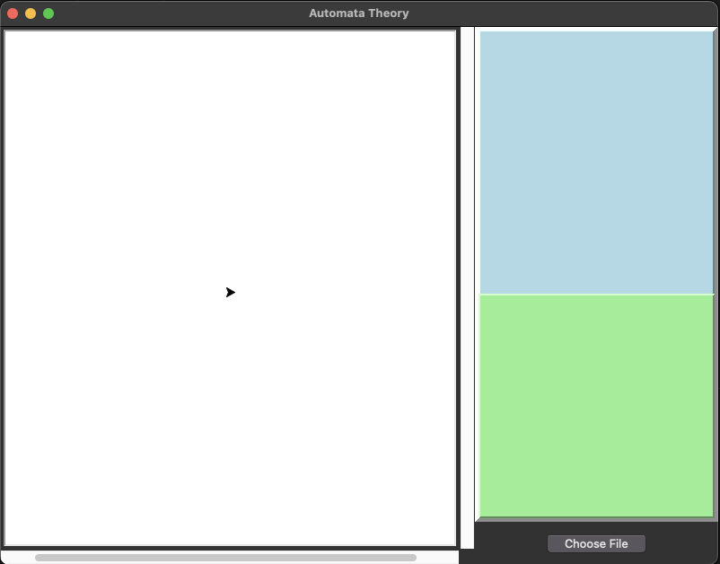
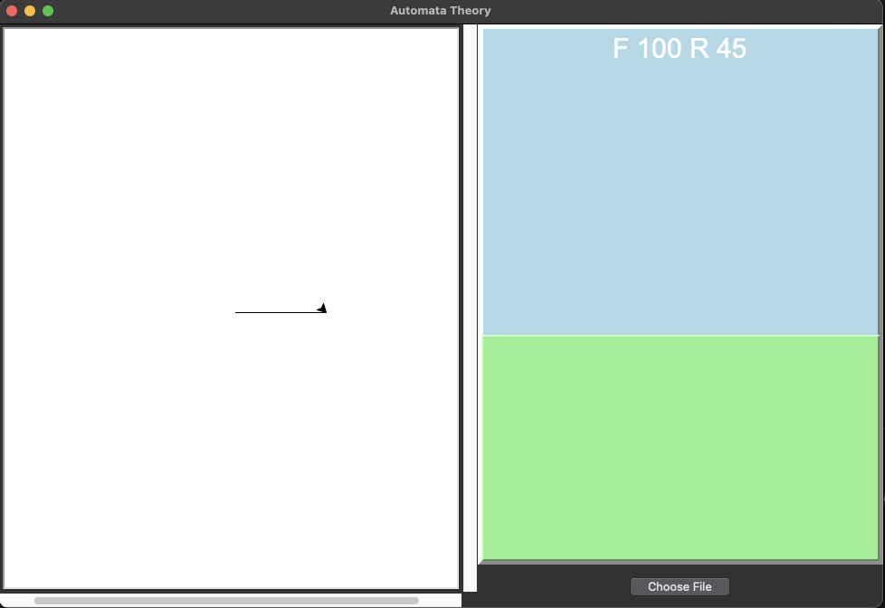
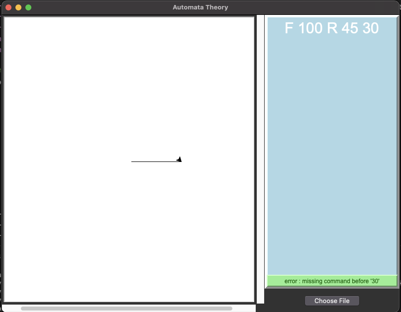

# LineDrawingVM

It reads from a selected .txt file and draw it into a panel.


#### GUI


By clicking the ```Choose File``` button, you can choose a .txt file, it will tokenize the file contents, parse it and will draw the shape into the left panel via Turtle.


-  By using a .txt file that our language can tokenize and parse, we can see that output on the screen. Click [here](https://github.com/oykunsay/LineDrawingVM/blob/master/example_text.txt) to see the file.



-  If there's an error in the syntax the output on the screen will look like this:


