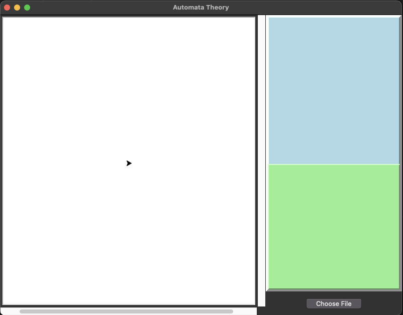

# LineDrawingVM
It reads from a selected .txt file and draw it into a panel.

#### GUI


By clicking the ```Choose File``` button, you can choose a .txt file, it will tokenize the file contents, parse it and will draw the shape into the left panel via Turtle.

